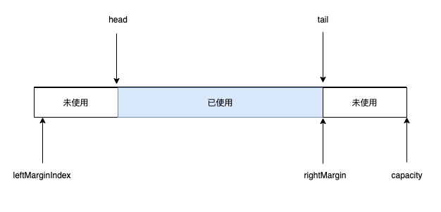
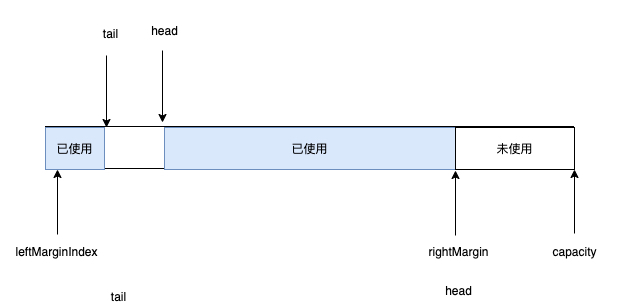
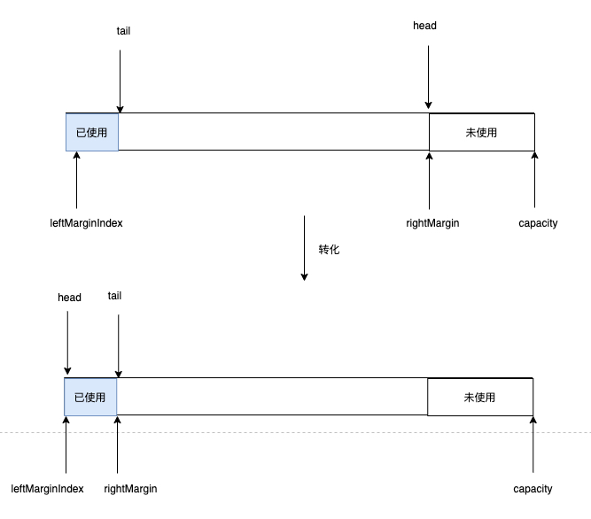

BytesQueue是一个线程不安全的fifo队列，底层基于bytes数组


#### 1. 整体设计






从上述两张图就可以看出作者对整个bytes_queue的设计。其实理论上，如果不考虑tail到head之前的情况，就是tail往后移动，head也往后移动，然后rightMargin是和tail保持一致的。一旦head到达rightMargin，说明队列出去完毕，然后head和tail移动到队列首部，开始新的操作。

但是因为存在一种case就是可能head还没到达rightMargin，但是用户想插入数据，tail之后的数据不够用了，那就要考虑这个head之前的空间够不够用，在这种情况下，tail和head的关系会变成图2的情况。


#### 2. Push

先看看Push这个操作的逻辑：

```go
func (q *BytesQueue) Push(data []byte) (int, error) {
	dataLen := len(data)
	headerEntrySize := getUvarintSize(uint32(dataLen))

	if !q.canInsertAfterTail(dataLen + headerEntrySize) {
		if q.canInsertBeforeHead(dataLen + headerEntrySize) {
			q.tail = leftMarginIndex
		} else if q.capacity+headerEntrySize+dataLen >= q.maxCapacity && q.maxCapacity > 0 {
			return -1, &queueError{"Full queue. Maximum size limit reached."}
		} else {
			q.allocateAdditionalMemory(dataLen + headerEntrySize)
		}
	}

	index := q.tail

	q.push(data, dataLen)

	return index, nil
}
```

他先对空间做了判断：

1. 是否在tail尾部能够插入数据
2. 是否在head前面能够插入数据
3. 是否满足扩容条件
4. 是否可以扩容

最后会执行真正的push逻辑，这里看看push逻辑:

```go
func (q *BytesQueue) push(data []byte, len int) {
	headerEntrySize := binary.PutUvarint(q.headerBuffer, uint64(len))
	q.copy(q.headerBuffer, headerEntrySize)

	q.copy(data, len)

	if q.tail > q.head {
		q.rightMargin = q.tail
	}
	if q.tail == q.head {
		q.full = true
	}

	q.count++
}
```

首先是把长度设置成bytes，然后先写入数据的长度，最后再写入数据。

这里会更新rightMargin，这里要注意了，如果是tail < head的情况，是不更新q.rightMargin的（因为此时边界并没有往右移动)

push里面的copy逻辑就是最简单的数据拷贝了

```go
func (q *BytesQueue) copy(data []byte, len int) {
	q.tail += copy(q.array[q.tail:], data[:len])
}
```


#### 3. Pop

```go
func (q *BytesQueue) Pop() ([]byte, error) {
	data, headerEntrySize, err := q.peek(q.head)
	if err != nil {
		return nil, err
	}
	size := len(data)

	q.head += headerEntrySize + size
	q.count--

	if q.head == q.rightMargin {
		q.head = leftMarginIndex
		if q.tail == q.rightMargin {
			q.tail = leftMarginIndex
		}
		q.rightMargin = q.tail
	}

	q.full = false

	return data, nil
}
```

Pop这里先调用peek，找到head对应的数据，这里细看下peek函数，binary.Uvarint函数从字节数组中取出一个uint64的编码，这里n是bytes的长度，然后从index + n(跳过长度) 读取blockSize的数据。

```go
func (q *BytesQueue) peek(index int) ([]byte, int, error) {
	err := q.peekCheckErr(index)
	if err != nil {
		return nil, 0, err
	}

	blockSize, n := binary.Uvarint(q.array[index:])
	return q.array[index+n : index+n+int(blockSize)], n, nil
}
```

然后head跳过已经Pop出来的数据，如果head到达底部，head就跳回到leftMarginIndex，在这种情况下，如果是正常场景：就是head ... tail，那么head跳了，tail也要跳。否则就是tail在head之前的场景，就不需要动，效果如下图：




#### 4. 扩容

```go
func (q *BytesQueue) allocateAdditionalMemory(minimum int) {
	start := time.Now()
	if q.capacity < minimum {
		q.capacity += minimum
	}
	q.capacity = q.capacity * 2
	if q.capacity > q.maxCapacity && q.maxCapacity > 0 {
		q.capacity = q.maxCapacity
	}

	oldArray := q.array
	q.array = make([]byte, q.capacity)

	if leftMarginIndex != q.rightMargin {
		copy(q.array, oldArray[:q.rightMargin])

		if q.tail < q.head {
			headerEntrySize := getUvarintSize(uint32(q.head - q.tail))
			emptyBlobLen := q.head - q.tail - headerEntrySize
			q.push(make([]byte, emptyBlobLen), emptyBlobLen)
			q.head = leftMarginIndex
			q.tail = q.rightMargin
		}
	}

	q.full = false

	if q.verbose {
		log.Printf("Allocated new queue in %s; Capacity: %d \n", time.Since(start), q.capacity)
	}
}
```

扩容是采用两倍扩容方案，然后执行拷贝操作。这里比较核心的逻辑是如果是tail < head, 那么需要把tail和head中间的区间补在margin后面，然后因为空间够用了，就让head和tail回归到正常位置。

这里其实我有个疑惑，我没看出来这个补充的意义是啥，因为copy(q.array, oldArray[:q.rightMargin]) 已经把中间的空白填充到新的数组中了。

