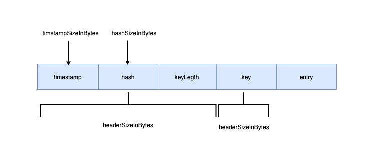

encoding函数是编码函数，他是hash的entry转换为bytes存储到byte队列的关键


#### wrapEntry

结合代码和解析图，可以知道底层的编码逻辑。这里传入了一个buffer，他是*[]byte类型，就是把timestamp和hash，key，entry压缩到buffer中，然后传出新的切片。这里应该是使用buffer避免了反复的slice分配，传入的新切片会被拷贝到bytes队列中，也就不存在后续的竞争关系了。

```go

const (
	timestampSizeInBytes = 8                                                        
	hashSizeInBytes      = 8                                                        
	keySizeInBytes       = 2                                                      
	headersSizeInBytes   = timestampSizeInBytes + hashSizeInBytes + keySizeInBytes  
)

func wrapEntry(timestamp uint64, hash uint64, key string, entry []byte, buffer *[]byte) []byte {
	keyLength := len(key)
	blobLength := len(entry) + headersSizeInBytes + keyLength

	if blobLength > len(*buffer) {
		*buffer = make([]byte, blobLength)
	}
	blob := *buffer

	binary.LittleEndian.PutUint64(blob, timestamp)
	binary.LittleEndian.PutUint64(blob[timestampSizeInBytes:], hash)
	binary.LittleEndian.PutUint16(blob[timestampSizeInBytes+hashSizeInBytes:], uint16(keyLength))
	copy(blob[headersSizeInBytes:], key)
	copy(blob[headersSizeInBytes+keyLength:], entry)

	return blob[:blobLength]
}
```

 



#### readEntry

该函数取出key的长度，然后取出entry（这里的entry是用户传入的，因此需要用户自己对value做bytes编码。

```go
func readEntry(data []byte) []byte {
   length := binary.LittleEndian.Uint16(data[timestampSizeInBytes+hashSizeInBytes:])

   // copy on read
   dst := make([]byte, len(data)-int(headersSizeInBytes+length))
   copy(dst, data[headersSizeInBytes+length:])

   return dst
}
```


这里直接看剩下的几个decode函数

```go
func readKeyFromEntry(data []byte) string {
   length := binary.LittleEndian.Uint16(data[timestampSizeInBytes+hashSizeInBytes:])

   // copy on read
   dst := make([]byte, length)
   copy(dst, data[headersSizeInBytes:headersSizeInBytes+length])

   return bytesToString(dst)
}

func readHashFromEntry(data []byte) uint64 {
   return binary.LittleEndian.Uint64(data[timestampSizeInBytes:])
}

func resetKeyFromEntry(data []byte) {
   binary.LittleEndian.PutUint64(data[timestampSizeInBytes:], 0)
}
```

